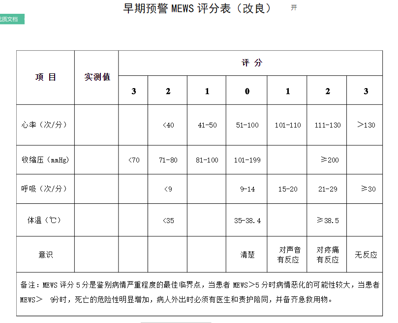

# Content
 * [Abstract](#abstract)
 * [param_for_MEWS_SQL.sql](#param_for_mews_sql)
 * [MEWSneed_matlab.m](#mewsneed_matlab)
 * [MEWS30.py](#mews30)
 * [MEWS.csv](#mews)
 
## Abstract

 
    本文件夹下程序的主要功能为：
        1.SQL提取AHE发生前30min内的GCS、Tem的最大值、最小值、平均值，缺失情况
            用前一个时刻的记录值代替
        2. matlab提取发生AHE前30min内HR、RR、SBP的最大值、最小值、平均值
        3. GCS、Tem缺失情况比较严重，多数都是用前一时刻的值代替的，所以用最大
            、最小、平均哪个值来计算MEWS都是一样的
         4. HR、RR、SBP用最大、最小、平均三个值分别计算，然后取得分最严重的
        
## param_for_mews_sql
     --本程序用来提取急性低血压前30min内的GCS及温度数据，如果没有，用最近的数值代替
        1.提取10小时之内的GCS（tem）值  
        2. -对10小时内的GCS(tem)值按时间顺序倒叙排列，最后30min内有缺失值时，
            用排在最前面的值代替，即为最近的一次测量
        3. 计算最后30min内gcs（tem）的最大值、最小值、平均值
        4.处理30min内gcs（tem）缺失数据，用最后一次测量记录代替
        5. 将最终提取出来的gcs、tem合并
          
##  mewsneed_matlab
    %Description：
    %   取AHE和nonAHE数据中预测窗口前30min的HR、RR、SBP用于计算MEWS
    %Input：
    %   筛选出来的发生AHE和未发生AHE的11小时数据段
    %Output:
    %   final_eigen,共11列，分别为HR、SBP、RR的最大、最小、平均值以及subject_id、classlabel

## mews30
    本程序主要功能为：
        1.为每一个样本计算MEWS评分
        2.根据ROC曲线，确定MEWS分类阈值
        3.根据MEWS评分对AHE进行分类
        
## mews
    计算MEWS评分用到的原始数据
        1.HR、RR、SBP只有最大值和平均值是因为最小值中异常的较多
        2.GCS、TEM只有一列是因为从数据库中提预测窗口前30min的数据时，这
            两个参数缺失的比较多，都是用前一时刻的观测值代替的，所以最后算出的
            最大值、最小值、平均值很相近，用来计算MEWS评分得到的结果是一致的